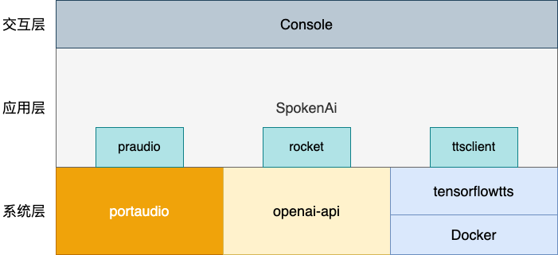
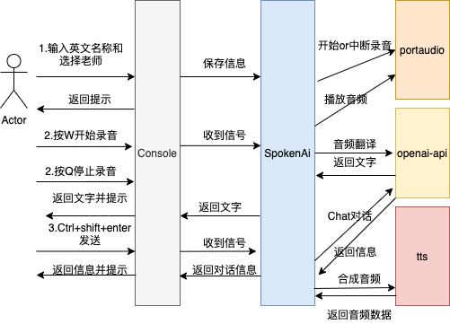

# SpokenAi
English | [简体中文](./README-zh.md)

	

		
	

	

		英语口语练习AI助手
	

## 一.前言

最近几个月大火大热的ChatGPT已经发布到ChatGPT4版本了，我也一直在关注ChatGPT的发展，一直在思考能基于ChatGPT或着说openai的能力能做出点什么应用，解决一些问题。

💥在仔细看过openai的[API文档](https://platform.openai.com/)后，发现openai不止提供了Chat的能力，还提供了如语音转文字，图片生成等能力。虽然没有ChatGPT那么火，但经过一番试用后，发现和ChatGPT效果一样让人惊艳。索性就直接来一个openai全家桶，通过openai的能力开发一款应用试试。

开发什么呢？ 🤔

ChatGPT对英语的语言能力自然不必说，而我们国人当下英语学习面临的一大问题就是哑巴英语，市面上的提供的英语对话机器人和ChatGPT比起来差得不是一星半点。只能请老师一对一真人教学？ 🤨  拜托，现在都2023年了，还需要花钱请口语老师么？

来造一款Ai口语练习应用解决这个问题 💯

## 二.支持功能

目前是一个简单版本的英语口语练习功能，支持如下功能
1. 读取语音输入
2. 语音转文字
3. 通过ChatGPT沟通交流
4. 文字转音频
5. 音频播放

ToDoList：  
- [ ]  寻找志同道合的小伙伴，有意向一起制作一款Ai应用的请联系我！！！
- [ ]  修复Bug，已知：mac播放音频存在兼容性问题、Tensorflowtts不支持长语句（>2048字节）合成语音
- [ ]  编码后端服务

## 三.系统架构

      

- portaudio:  PortAudio是一个跨平台的音频I/O库，提供了简单的API，使得开发人员可以在不同的平台上以相似的方式访问音频硬件。它支持Windows、Mac OS X、Linux和其他主要的操作系统。PortAudio支持多种音频API，包括ASIO、Core Audio、DirectSound、MME / WDM、ALSA和OSS。PortAudio还包括一个流接口，允许开发人员以相同的方式使用不同的音频API和硬件。   

- openai-api: 提供了多种API服务，包括但不限于自然语言处理、语音转文字、文字转语音、图像生成等。在OpenAI的API文档中，用户可以申请API密钥，并使用API进行开发和测试。

- tensorflowtts: [TensorflowTTS](https://github.com/TensorSpeech/TensorflowTTS) 是一个基于 TensorFlow 的语音合成工具包，它包含了多种语音合成模型和前处理工具，并且支持多种语音合成任务，例如有人声合成（Vocoder）、语音转换、语音增强等。它可以帮助开发者快速搭建语音合成模型，定制自己的语音合成系统。
- Docker: Docker是一种容器化技术，可以将应用程序及其依赖项打包在一个容器中，以便在任何地方运行。容器是一种轻量级的虚拟化技术，可以提供与传统虚拟机相似的隔离性和安全性，但占用的资源更少。Docker还提供了一套工具和平台，使得容器的构建、部署和管理变得更加容易。
- SpokenAi:整体应用层，其中有三个库分别是praudio、rocket、ttsclient，对应如下作用
    1. praudio: 封装portaudio，对外提供音频录制和音频播放等接口
    2. rocket: 封装openai-api, 对外提供Chat接口、音频转文字等接口
    3. ttsclient: 提供调用容器化运行的tensorflowtts的接口
- Console: 终端交互层，用户按提示进行操作，输入信息和进行相关操作

   Tips:tensorflowtts 依赖较多，为方便完整，这里采用Docker部署
## 四.流程设计

      

简单概括总体流程有三个步骤，一是输入个人信息  二是录音转文字，三是发送消息，进行对话交互

由于是通过终端访问，主要监听键盘事件，进行不同操作

如 按W键会开始录音，录音过程中按Q停止录音，待录音翻译完成后，按Ctrl+shift+enter发送消息

  <b>SPONSORED BY</b>

   

